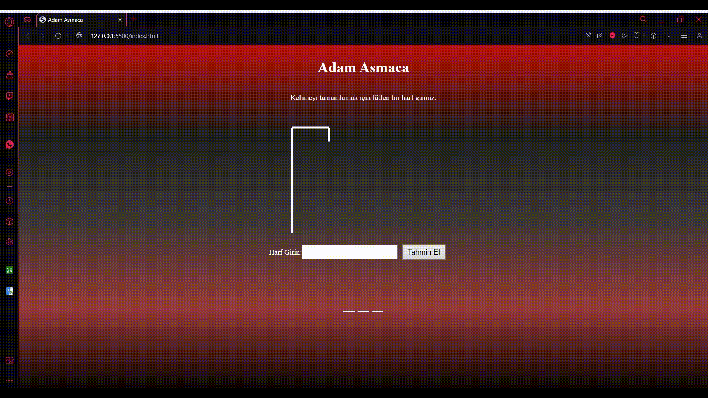

# Adam Asmaca Oyunu

Bu proje, klasik "Adam Asmaca" oyununu basit bir web uygulaması olarak uygular.

## Oyunun Amacı

Oyunun amacı, gizli bir kelimenin tüm harflerini doğru bir şekilde tahmin ederek oyunu kazanmaktır. Ancak yanlış tahminler yaparak "adam asılmadan" önce kelimeyi tamamlamak gerekmektedir.

## Nasıl Oynanır?

1. Sayfa üzerinde görünen kelimenin harflerini doğru bir şekilde tahmin etmek için giriş alanına bir harf girin.
2. Yanlış tahminler yapıldıkça, "adamı asan" çizim belirecektir.
3. Tüm harfleri doğru tahmin ederek oyunu kazanmaya çalışın.

## Nasıl Çalıştırılır?

1. Repo'yu bilgisayarınıza klonlayın.
2. İlgili HTML dosyasını tarayıcınızda açarak oyunu başlatın.
3. Tahminlerinizi giriş alanına yaparak oyunu oynayın.

## Ekran Görüntüsü

